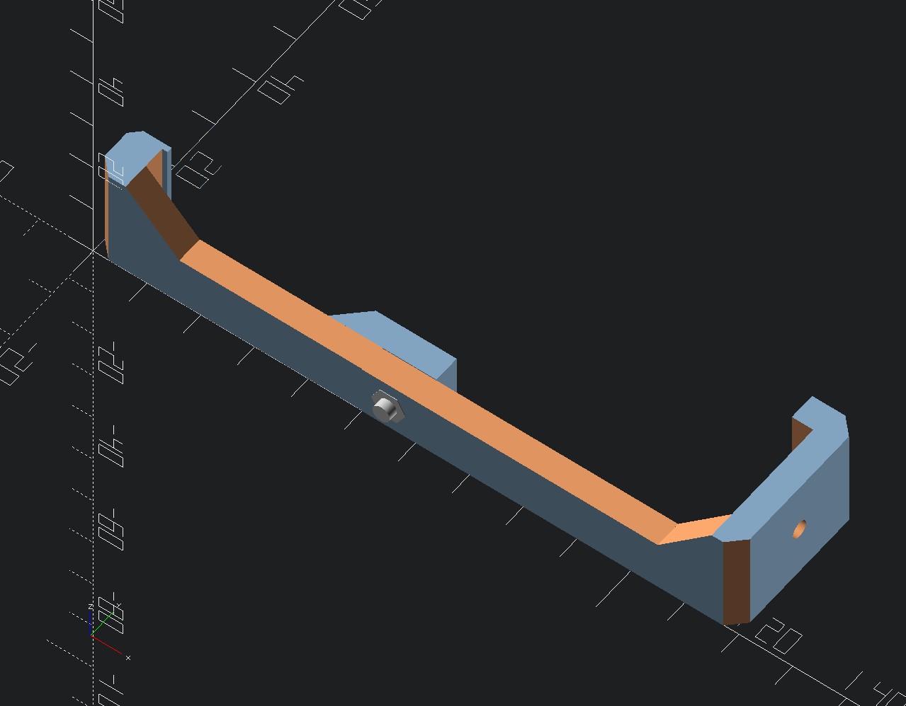

# Info

These hooks helped me holding the gantry in place at installation. So I had not to hold gantry with zipties, which would be very difficult when installing them on my own.
Installation and removement are a bit tedious. But still easier than installing zipties alone ;).

## Update 02/2023
After some feedback I modified the hooks to use them with a M3x8 Screw (cylinder head) and a M3 Nut.
This should enable more easy removement of the hooks after installing the belts.

