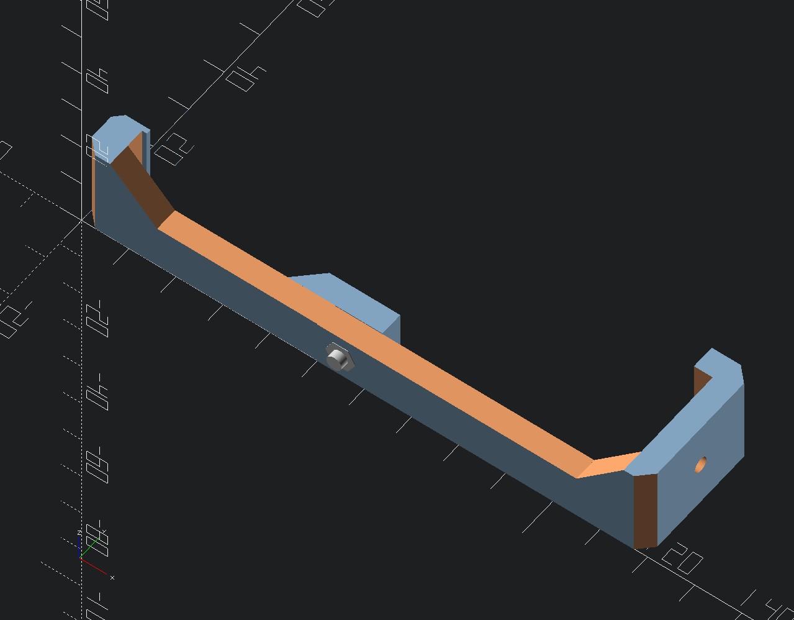
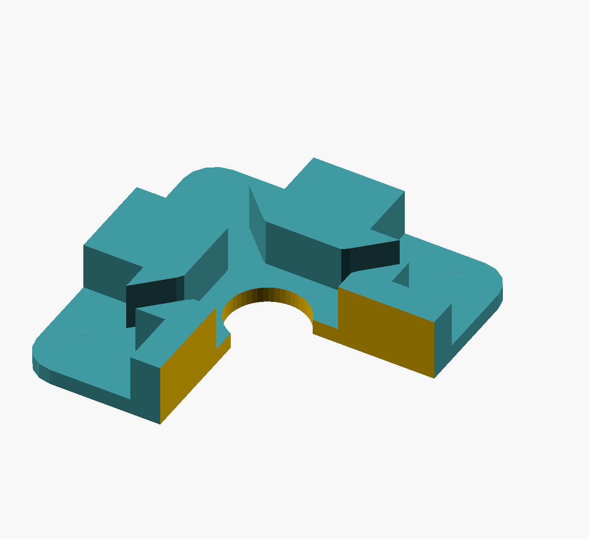
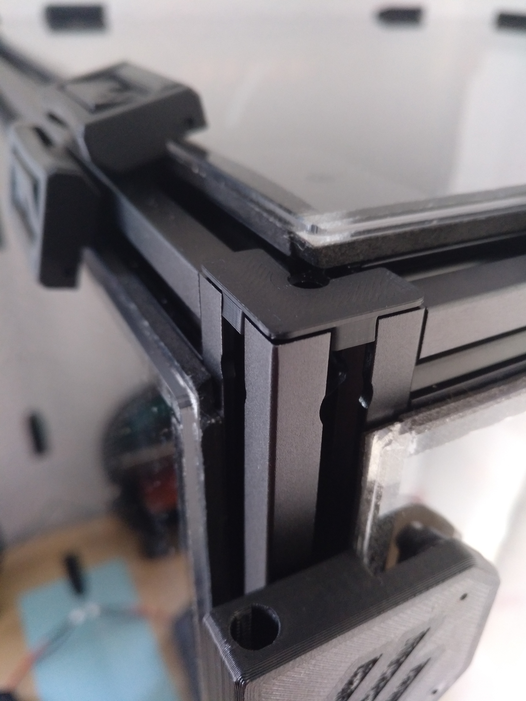
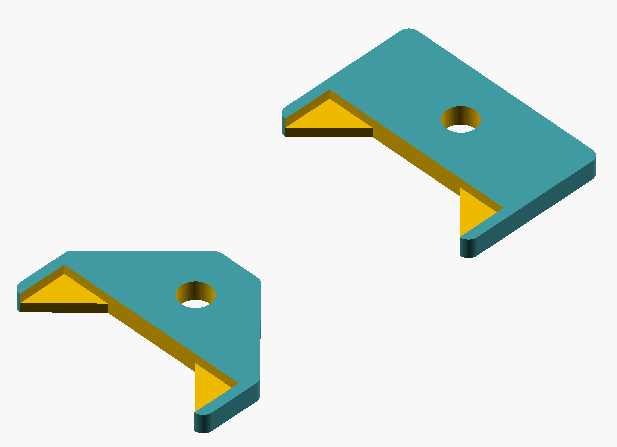
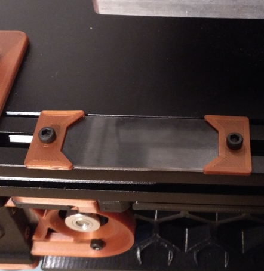
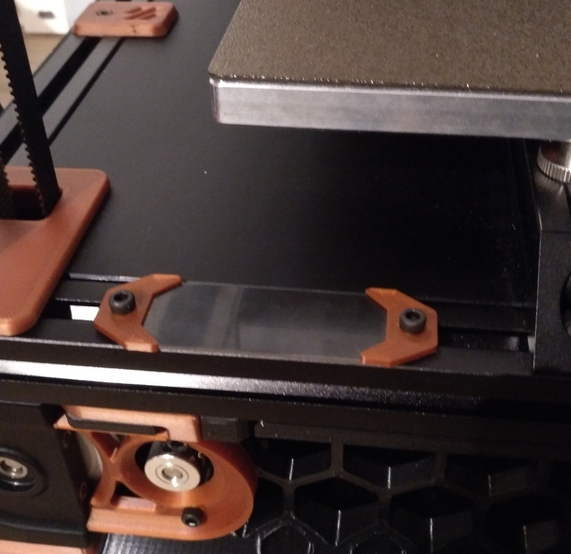

# __My Voron Mod Repository__

## This Repository contains my personal Voron Mods.

|No. | Mod             |  Image |
|:--:|:---------------:|:------:|
|001| Voron 2.4 Gantry Installation Hook v2 (not tested!!)| |
|002|2020 Extrusion Caps - Remix from chking https://www.printables.com/de/model/71822-2020-endcap ||
|003|Serial Plate for LDO Kits and other plates (configurable) ||

 
 
 

# __Videos__

currently no videos

# LICENSE

<dl>
 Dieses Werk ist lizenziert unter einer <a rel="license" href="http://creativecommons.org/licenses/by/4.0/">Creative Commons Namensnennung 4.0 International Lizenz</a>.
</dl>

<dl>
 This work is licensed under a <a rel="license" href="http://creativecommons.org/licenses/by/4.0/">Creative Commons Attribution 4.0 International License</a>.
</dl>
